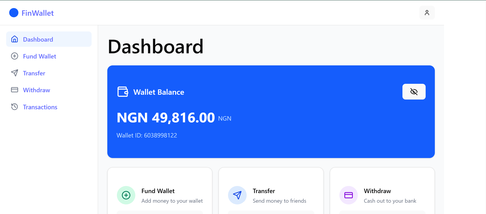
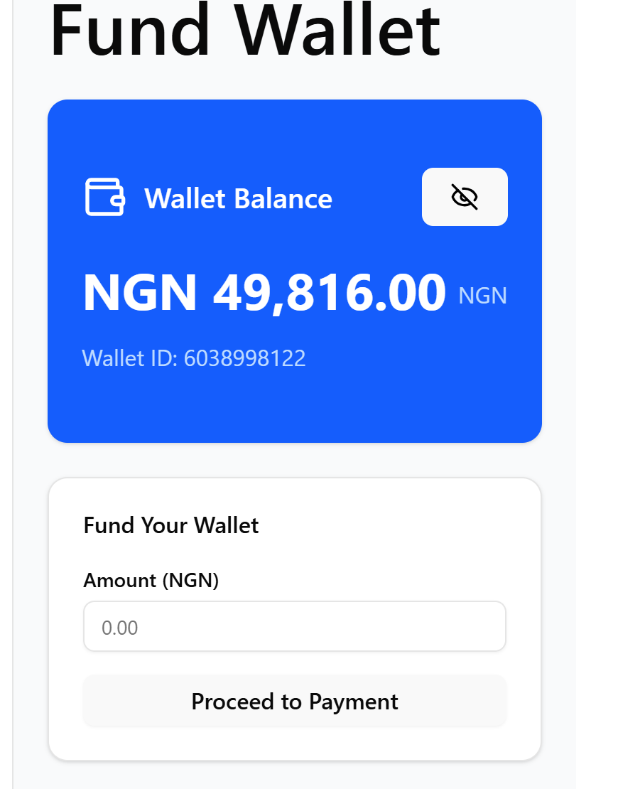
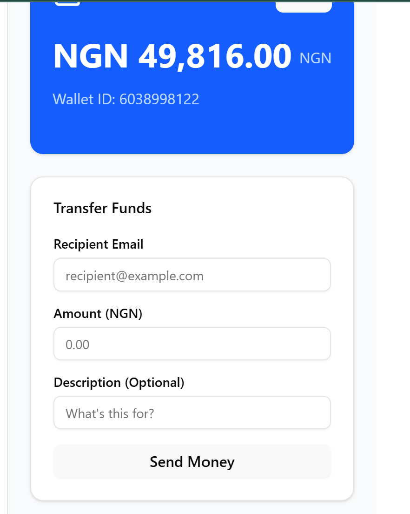
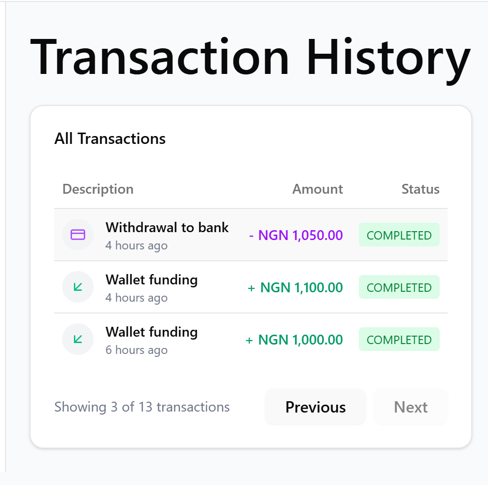

# Fintech Wallet Frontend

A modern, responsive React application that serves as the user interface for the Fintech Wallet API. This application allows users to register, log in, fund their wallet, transfer funds to other users, withdraw to bank accounts, and view transaction history.

## Features

- 🔒 **Secure Authentication** - User registration and login with JWT
- 💼 **Dashboard Overview** - Visual summary of wallet balance and recent transactions
- 💰 **Wallet Management** - Fund wallet via Paystack, transfer to other users, withdraw to bank
- 📊 **Transaction History** - View and filter transaction history with pagination
- 📱 **Responsive Design** - Works seamlessly on desktop and mobile devices
- 🎨 **Modern UI** - Built with shadcn UI components for a clean, professional look

## Tech Stack

- **Framework**: React with TypeScript
- **State Management**: React Context API
- **Styling**: Tailwind CSS with shadcn UI components
- **HTTP Client**: Axios
- **Form Handling**: React Hook Form with Zod validation
- **Routing**: React Router
- **Authentication**: JWT stored in HTTP-only cookies

## Screenshots






## Project Structure

```
// File structure for the React application
src/
  ├── components/
  │   ├── ui/          // shadcn components
  │   ├── layout/
  │   │   ├── Navbar.jsx
  │   │   ├── Sidebar.jsx
  │   │   └── AuthLayout.jsx
  │   ├── auth/
  │   │   ├── LoginForm.jsx
  │   │   └── RegisterForm.jsx
  │   ├── wallet/
  │   │   ├── WalletCard.jsx
  │   │   ├── FundWalletForm.jsx
  │   │   ├── TransferForm.jsx
  │   │   ├── WithdrawForm.jsx
  │   │   └── TransactionHistory.jsx
  │   └── common/
  │       ├── LoadingSpinner.jsx
  │       ├── Alert.jsx
  │       └── ConfirmationModal.jsx
  ├── pages/
  │   ├── auth/
  │   │   ├── Login.jsx
  │   │   └── Register.jsx
  │   ├── dashboard/
  │   │   ├── Dashboard.jsx
  │   │   ├── Fund.jsx
  │   │   ├── Transfer.jsx
  │   │   ├── Withdraw.jsx
  │   │   └── Transactions.jsx
  │   └── NotFound.jsx
  ├── services/
  │   ├── api.js
  │   ├── authService.js
  │   └── walletService.js
  ├── context/
  │   └── AuthContext.jsx
  ├── hooks/
  │   ├── useAuth.js
  │   └── useWallet.js
  ├── utils/
  │   ├── formatters.js
  │   └── validators.js
  ├── App.jsx
  └── index.jsx
```

## Installation

### Prerequisites

- Node.js (v14 or higher)
- Backend API running (see [Backend README](../server/README.md))

### Local Setup

1. Clone the repository:

   ```bash
   git clone <repository-url>
   cd fintech-wallet/client
   ```

2. Install dependencies:

   ```bash
   npm install
   ```

3. Create a `.env` file in the root directory:

   ```
   VITE_APP_SERVER_URL=http://localhost:3000/api/v1
   ```

4. Start the development server:

   ```bash
   npm run dev
   ```

5. The application will be available at `http://localhost:5173`

## Building for Production

1. Create a production build:

   ```bash
   npm run build
   ```

2. The build files will be generated in the `dist` directory

3. Preview the production build locally:

   ```bash
   npm run preview
   ```

## Testing

Run the test suite:

```bash
npm run test
```

## User Flows

### Registration & Login

1. Users can create an account with email, password, and personal details
2. Upon registration, users receive a JWT token for authentication
3. Returning users can log in with their credentials

### Funding Wallet

1. Users initiate funding from the dashboard or wallet page
2. They're redirected to Paystack's checkout page
3. After successful payment, they're redirected back to the app
4. Wallet balance is updated and they receive an email notification

### Transferring Funds

1. Users enter recipient's email and amount to transfer
2. After confirmation, funds are instantly transferred
3. Both sender and recipient can view the transaction in their history

### Withdrawing Funds

1. Users enter bank details and withdrawal amount
2. System calculates fee (₦50) and confirms the withdrawal
3. Funds are deducted from wallet and withdrawal is processed

## Integration with Backend

This frontend application communicates with the [Fintech Wallet API](../server/README.md) for all operations. Make sure the backend is running and properly configured for the frontend to work correctly.

## Deployment

The frontend is deployed on Vercel at: [https://fintech-wallet-app.vercel.app](https://fintech-wallet-app.vercel.app)

For deployment on Vercel:

1. Connect your GitHub repository to Vercel
2. Configure the build settings:
   - Build Command: `npm run build`
   - Output Directory: `dist`
   - Install Command: `npm install`
3. Add environment variables in the Vercel dashboard

## Known Issues

- The application may experience a slight delay on first load due to the backend being hosted on Render's free tier, which spins down after inactivity

## Future Improvements

- Add multi-factor authentication
- Implement dark mode
- Add more payment methods
- Add charts for spending analytics
- Implement push notifications
